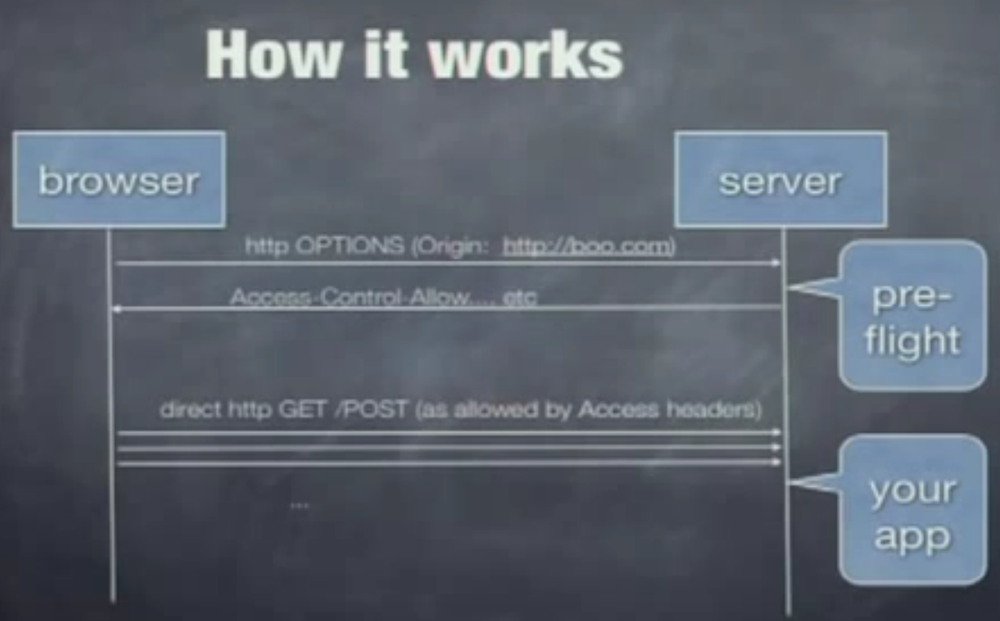

# Security

### Same Origin Policy (SOP) enforced by all browsers
Purpose is to protect data. Data from one application (e.g netbank) should not be accessed by an application opened in another tab or window.
  - Blocked
    - Different port 
    - Different host: 
        - sub domain is a different host
    - Different protocol: http/https
  - Allowed
    - Sub folders under same domain
SOP does NOT apply to ressource loading (like bootstrap or jquery or other js script loaded into the page)

A malicious script can trigger a request to a trusted site BUT it can not read the response. (UNLESS CORS on trusted site permits it)
  - Work around
    - jsonp (JSON with Padding)
      - pure json made  into a function call -> then evaluated in browser gets around SOP
    - CORS headers on server ressource: 
    
      - One OPTION request with only request header telling what origin the asking page comes from.
      - Server responds with what is allowed (POST, GET etc. )
      - All subsequent requests done with no more checks.
      - Headers send from server
      `Access-Control-Allow-Origin: https://developer.mozilla.org` or `Access-Control-Allow-Origin: *`  
      `Access-Control-Allow-Methods: POST, GET, OPTIONS`
      - created in java servlet filter like this: `response.setHeader("Access-Control-Allow-Origin", request.getHeader("Origin"));` after the request.getHeader("Origin") value is checked against a list of allowed origins.