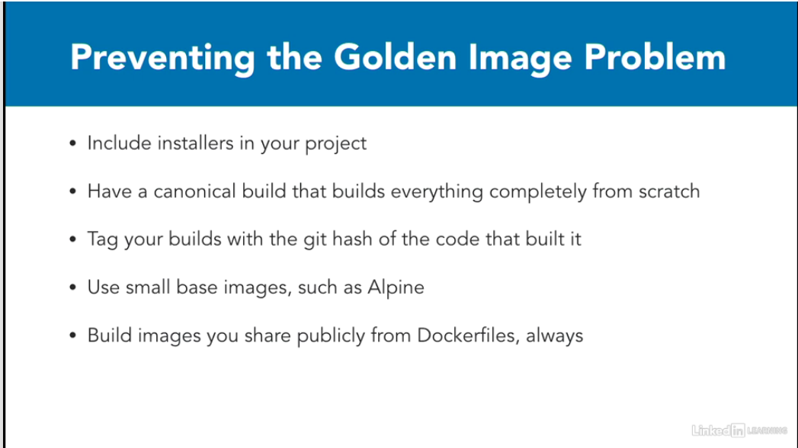
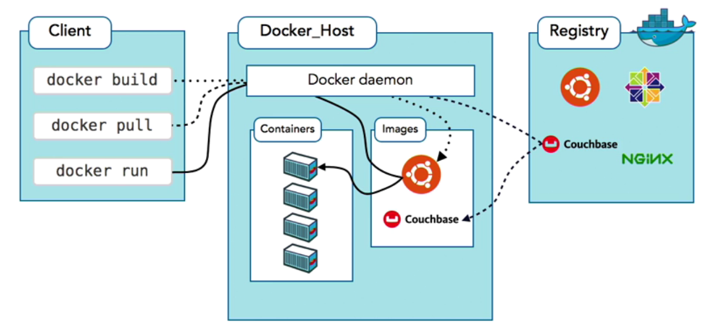

# Learning docker
lynda.com video: Learning docker with Arthur Ulfeldt

## Getting started
First image to pull from docker hub: hello-world `docker run hello-world` just to see that docker is working allright.


## commands
00. `docker  container --help` show all available commands for docker container. `docker container run --help` to see specific for run command.
01. `docker run -ti --rm ubuntu bash` starts the ubuntu image container in interactive bash mode (--rm removes the container after exit. Else `docker stop <container id>` and `docker container rm -f <container name>` is necessary to run after), (-ti: terminal interactive). docker run includes a `docker pull <image>` that gets the image from docker hub, if it is not downloaded yet. `docker pull` and `docker push` are commands to pull and push images to docker hub.
02. `ctrl d` or write: `exit` to get back to own terminal
03. `docker run <image>` takes an image an starts up a container
04. `docker run -ti ubuntu:latest bash` to get the latest image version.
05. changes done to a container does not change the image. when the container stops the changes are only in the container UNLESS: use volumes
06. `docker ps -a` to see all containers (not only running ones)
07. `docker commit <image hash>` this creates a new docker image from a container. All changes made to the system in the running container, will now be available as an image. The image gets an impossible long hash for a name. To get a good name for the image we create a TAG
08. `docker tag <image sha> <tag name>` the image sha came from the command docker commit. The tag name is made up by myself.
09. Shortcut to commit: `docker commit <container name> <tag-name>` creates a new image from a container.
10. `docker run -it ubuntu bash -c "in here comes the commands to be run in the container"` -c means we give some arguments to what commands to run in the bash.
11. `docker run -d -it ubuntu bash` -d starts the container in 'detached mode' with a reference to the container so that we can attach it again with `docker attach <sha or container name optained from docker ps`. Detached means that the docker main process runs in the background and the terminal is free to be used for other things. An attached running container can be detached with short-cut-keys: ctrl p + ctrl q.
12. `docker exec -ti <container name> bash` attaches another bash terminal to a running container.
13. `docker run --name <some name for the container>` start a container and give it a name
14. `docker logs <container name>` see the output for the container (even if it is stopped or running in background)
15. `docker rm <container name>` removes an old container by name
16. `docker run --memory <some limit>` or `docker run --cpu-shares <some share relative to other containers>` to limit the ressource allocation to the container

## Networking
Exposing ports and linking containers as a form of private network of nodes.
`docker run -ti -p 8080:8081 -p 3307:3307 --name <some new container name> ubuntu:14.04 bash` this will map trafic comming to port 8080 on the host machine to port 8081 on the container etc.
`docker network create <network name>` to create a new network for linking docker containers the network will have a lookup service so nodes on the network can find each other by their container names. Then
`docker run --net=<network name> --name <new container name> ubuntu:16.04 bash`. to add nodes to the network.
`docker run -p 127.0.0.1:1234:1234/tcp` only forward trafic from localhost to port 1234

## Managing images
`docker -rmi <image name>:<tag name>` remove an image from the system.
- Docker images comes from docker registries. You can run your own. The biggest is docker hub
- `docker search ubuntu` finds all the images called something with ubuntu. Here we can see how many stars it has (how popular it is) and if it is an official docker image.
- `hub.docker.com` search on the web for an image. Here will be readme files etc. with info.

## Volumes
Volumes are data shared (like a shared folder on virtual machines) that are shared between the docker image and the host. There are 2 kinds of volumes: 1. persistent and 2. ephemeral. First the ephemeral ones: volumes. They are not saved and lives only as long at they
1. `docker run -ti -v /home/thomas/docker_drive/vol1:/<foldername for docker> ubuntu bash` this makes a folder on the docker system by that given name that is share with the host machine on the given path.
2. `docker run -ti -v /shared_folder ubuntu bash` creates a folder on the container that (is not shared with the host, but) can be shared by other containers. THEN: 
3. `docker run -ti --volumes-from <container name> ubuntu bash`. The '--volumes-from creates a shared folder to the other running container.

## Building images
- `docker build -t <new tag name> .` Note the dot at the end. to find the location of the Dockerfile in current directory. the -t is for 'tag'.
- Dockerfiles are not shell scripts (even though they look it).
- Processes started on one line will not run on the next. Instead they run for the duration of a container, that eventually gets saved to an image and dies.
- Each line in Dockerfile is a call to docker run.
- Dockerfile syntax:
  - `FROM` statement
    - which docker image to download and start from
    - must be the first command in the file
  - `MAINTAINER` statement
    - who is responsible, who to contact in case of problems
  - `RUN` statement
    - runs the command, wait for it to finish and safes the result in a container. There are often many of those in a Dockerfile.
  - `ADD` statement
    - can add a new file to the container `ADD run.sh /run.sh`, makes file: run.sh and puts it in /run.sh location
    - can extract files from a .tar.gz file into a folder on the image: `ADD project.tar.gz /install/`
    - can add from URL: `ADD https://project.example.com/downloads/project.rpm /project/`
  - `ENV` statement
    - sets environment variables
    - they will not die with the actual container, but live on in the fianl image.
    - `ENV DB_HOST=db.production.example.com`
  - `ENTRYPOINT` and `CMD`
    - to run commands
  - `EXPOSE` same as we did with docker run -p it exposes a port.
  - `VOLUME` creates shared or ephemeral volumes: 
    - shared: `VOLUME ["host/path", "container/path"]` share a location with the host (CON: it binds the container to only work on the specific host and can not be shared with other locations. Therefore often not at good idea)
    - ephemeral: `VOLUME ["/shared_data"]` creates a volume that only exists in the docker container and can be shared with other containers. This choice is often best.
  - `WORKDIR` sets the directory to where the container will allways start from internally.
  - `plus many many more ...`

## Warning: prevent the golden image problem


## Docker workflow:



## Docker Compose
- `docker-compose --help`
docker-compose is a program that helps when running many containers.
It must be installed seperately. 
- A file is created called: 'docker-compose.yml'
- In the file, write the commands. e.g: 
```yaml
my-test:
 image: hello-world
```
where 'my-test' will be part of the container name and the image will be pulled from hub.docker.com.
- From the same directory we call `docker-compose up` in order to start up all the containers from the yaml file.